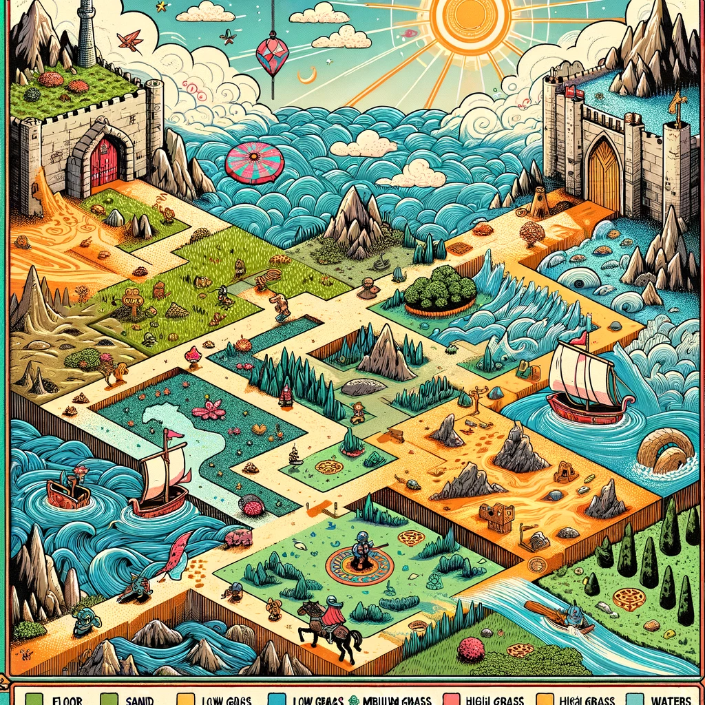

# pyMundo

Simulador de mundo virtual en consola que permita la exploración de un entorno predefinido. 

Este sistema debe representar visualmente diferentes elementos del entorno utilizando caracteres y colores, implementar ciclos de día y noche que afecten la jugabilidad, y permitir la navegación interactiva de un personaje a través del mundo creado.

[Vídeo en Youtube](https://www.youtube.com/embed/CREnNKLTmqQ)

## Requisitos

El simulador debe cumplir con los siguientes requisitos:

### Representación del mundo

- Crear un mundo virtual utilizando caracteres ASCII que representen diferentes elementos como:
  - Estructuras (muros, puertas, ventanas)
  - Terrenos (agua, hierba, caminos)
  - Elementos decorativos (árboles, rocas, objetos)
- El mundo debe tener dimensiones suficientes para permitir la exploración

### Sistema de visualización

- Mostrar sólo una porción del mundo alrededor del personaje
- Implementar diferentes modos de visualización que el usuario pueda alternar
- Utilizar colores para diferenciar los distintos elementos del mundo

### Ciclo día/noche

- Implementar un sistema de tiempo que simule el paso de las horas
- La visibilidad del jugador debe verse afectada según la hora del día
- Representar visualmente los cambios de iluminación en el entorno

### Navegación y colisiones

- Permitir el movimiento del personaje en cuatro direcciones
- Implementar detección de colisiones para elementos no atravesables
- Limitar el movimiento a los confines del mundo definido

### Interfaz de usuario

- Capturar la entrada del usuario para controlar el personaje
- Mostrar información relevante como la hora del día y la posición actual
- Proporcionar comandos para cambiar la visualización y salir del juego

## Extras

Una vez implementado el simulador básico, podrían considerarse las siguientes extensiones:

1. Añadir interacción con objetos del entorno
2. Incorporar personajes no jugables que sigan patrones de movimiento
3. Implementar condiciones climáticas que afecten la jugabilidad
4. Desarrollar un sistema para crear y cargar diferentes mapas
5. Añadir misiones u objetivos que guíen la exploración

### Elementos Adicionales Deseables

- Distintas áreas o escenarios dentro del mismo mundo
- Efectos visuales que enriquezcan la experiencia
- Sistema intuitivo de navegación y controles

## Anexo

### Tipos de terreno & caracterísicas

|Terreno|Transitable|Velocidad|
|-|-|-|
|Suelo|Sí, a pie|1|
|Arena|Sí, a pie|1|
|Paredes|No|0|
|Cesped bajo|Sí, a pie|1|
|Cesped medio|Sí, a pie|2:1|
|Cesped alto|A caballo|1:2|
|Aguas|Sí, en bote|1:1|
|Aguas turbulentas|Sí, en bote|2:1|
|Montañas|Si, con alfombra voladora|1:1|

Se ha de implementar el ciclo de día / noche, incluyendo una representación del cielo, del sol y de la reducción del campo de visión durante la noche.

### Transporte

Los medios de transporte son:

- Andar a pie
- Montar a caballo
- Ir en bote/barco
- Alfombra voladora

### Ejemplo de un generador de mapa

[Mapa en Google Spreadsheet](https://docs.google.com/spreadsheets/d/1T5UmyhdSU-Wn9zvgflbkldfbs4UWuRUDgouS8b5IqUI/edit?usp=sharing)

